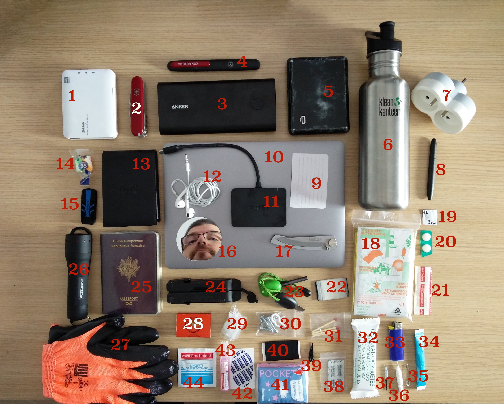

# Everyday Carry (EDC)

From: https://korben.info/n-kit-survie-geek-sac-dos-everyday-carry.html

Vous le savez, je bouge beaucoup. Et comme en ce moment, c’est pire que d’habitude, je me suis refait un joli sac à dos tout beau. En mode kit de survie Geek évidemment. En américain, ça s’appelle EDC.

Pour ceux qui ne connaitraient pas ce terme EDC ça veut dire Everyday Carry. En gros, c’est ce que vous emmenez tous les jours sur vous afin de prévenir n’importe quel pépin.

Les survivalistes sont friands de ce genre de matériel de survie et je me suis clairement inspiré d’eux pour composer ce backpack. L’objectif c’est de pouvoir bosser, se soigner, bricoler, boire, manger, se chauffer, peu importe les circonstances.

L’idée n’est pas de se dire que si c’est la fin du monde, vous allez pouvoir survivre avec ce truc, ni même que vous allez pouvoir vous retrouver au fond des bois et y passer 15 jours en mode stage commando Bear Grylls et expérimenter toutes vos techniques de survie.

Non, pas du tout. L’idée c’est de prévenir beaucoup des petits tracas de la vie… Genre, le bouton de chemise qui saute, le barbecue qu’on ne peut pas démarrer, car on n’a pas de feu, le petit bobo qu’on se fait et qu’on ne peut pas soigner, la batterie du téléphone qui se retrouve à plat, le coup de froid ou le malaise qu’on n’avait pas vu venir…Etc.

Ce que je vais vous présenter en est à la version 1.0. En gros, je n’ai pas encore tout optimisé et certains trucs sont redondants, et certains d’entre vous auront surement de bons conseils à m’apporter. Au-delà de ça, ça vous donnera aussi surement de bonnes idées cadeaux pour Noël, la fête des Pères, la fête des Mères, les anniversaires…etc.
Mon Kit de Survie

Voici donc ce que j’ai mis dans mon sac :

Et une fois rangé, avec en complément un petit sac sacoche de câbles (USB, adaptateurs…etc.), ça tient dans ce sac ordi que j’ai eu en cadeau à une conf dernièrement. Et j’ai encore un peu de place pour y mettre quelques fringues, un livre…etc.

2016-06-02 16.08.41

Alors, je vais maintenant vous décrire tout ça, numéro par numéro, en vous mettant les détails, les liens affiliés de sale capitaliste et les cas d’utilisation…
Mini routeur wifi (1)

Je l’utilise tout le temps lorsque je suis à un endroit où le wifi est pourri ou lorsqu’il n’y a qu’une prise Ethernet à se partager, afin d’arroser en Wifi tout le monde. Le mien est assez ancien, mais j’ai aussi celui ci-dessous (que j’utilise comme PirateBox) qui est très bien et pas cher.

Le cas classique d’utilisation, c’est quand j’arrive dans un AirBnB ou chez un pote, et que je n’ai pas le mot de passe du wifi. Je branche ce routeur au cul de la box Internet et c’est bon.

Je vous recommande de le prendre avec une batterie, c’est mieux. Prévoyez aussi un câble Ethernet en rab.

51asLbKALjL._SL1280_
Couteau suisse (2)

Un classique. Ce petit couteau de survie, je l’ai toujours au fond de ma poche. J’utilise principalement la grande lame, les ciseaux, le cure-dent et le tournevis.

81jFcTRfxNS._SL1500_

Batterie externe (3)

J’utilise beaucoup mon smartphone et mon ordinateur, donc j’ai besoin d’une bonne batterie. J’ai choisi une Anker PowerCore+ 26800 qui me permet de charger 10 fois mon téléphone ou 3 fois mon ordinateur portable.
anker-powercore-plus-26800-9

Aiguiseur de couteau (4)

Ce n’est pas indispensable, mais si vous avez besoin de couper un truc et que votre lame est un peu émoussée, ça permet de récupérer un peu de tranchant temporairement. Ça ne vaut pas un passage chez le coutelier ou une pierre à aiguiser, mais ça dépanne (petit tuto ici).

71UwdpUgS8L._SL1500_

Portefeuille (5)

Celui-là, je l’adore. Il ne permet pas de transporter de la monnaie et peut contenir une quantité limitée de cartes de crédit, de billets ou de tickets, mais c’est pas plus mal, car au moins, je suis obligé de faire le ménage dedans régulièrement. Il est solide, en métal et bloque les ondes, donc si vous craignez pour vos cartes RFID, c’est le top !

Comme vous pouvez le voir sur la photo, le mien est déjà un peu ancien et s’est un peu usé. Pensez aussi à mettre un peu d’argent liquide (billets) dans votre EDC au cas où.
51NlfAn7PTL._SL1280_
Gourde (6)

Pas indispensable non plus, vous pouvez la remplacer par une bouteille d’eau. Toutefois, la gourde, c’est plus écolo et quand elle est en métal comme la mienne, je peux y faire bouillir de l’eau si je le souhaite. A savoir pour trouver de l’eau partout où vous allez, il existe une base de données open qui s’appelle Eaupen et qui référence tous les points d’eau potable. Pratique pour remplir sa gourde.
k27pps_bg

Multiprise (7)

Je manque souvent de prises, à l’hôtel ou dans le train. Et quand une prise est déjà prise (roh roh), je peux proposer à celui qui l’utilise de la partager avec moi grâce à cette multiprise. Avant j’avais un bloc rallonge de 3 prises, mais ça prend un peu de place. J’accompagne cette multiprise d’un adaptateur universel lorsque je me rends à l’étranger.

310MU1Q7qdL

Stylo (8)

Pour écrire, c’est pratique. Avec un Space Pen (cher) ou un Down Force (pas cher), la cartouche d’encre est pressurisée,  ce qui lui permet d’écrire sous l’eau, à l’envers, dans l’espace, et dans toutes conditions de températures extrêmes…etc. Ouais encore un truc de geek
51kmxmNPulL._SL1200_

Vous pouvez aussi ajouter un petit marqueur type Sharpie à votre kit.
Mémo (9)

Ça, c’est une petite carte sur laquelle j’ai écrit mon nom, prénom, les numéros de téléphone de mes proches en cas d’urgence et mon groupe sanguin. Je l’ai ensuite plastifiée avec du scotch.
Ordinateur portable (10)

J’ai récupéré un petit MacBook de 2015. Poids plume, donc super !
Adaptateur USB Type-C (11)

Par contre, comme sur le MacBook, il n’y plus qu’un port USB type C, j’ai acheté cet adapteur Aukey qui propose un connecteur HDMI, 4 connecteurs USB et un connecteur USB C. Indispensable !

617FkmECs3L._SL1500_
Écouteurs (12)

Mon casque audio. Indispensable pour bosser en musique ou pouvoir regarder un film sans embêter les gens.

613500qdpCL._SL1400_
Carnet (13)

Quand je bosse, je prends des notes. J’ai donc ajouté à mon EDC un mini carnet Rhodia avec sa protection. Ça me donne des airs de grand reporter.

81i-X69i2HL._SL1500_

Boules Quiès (14)

Comme je fais pas mal de hottes, de Airbnb ou de piaules à l’arrache, je ne sais jamais trop où je vais atterrir. En cas de bruit relou la nuit (genre quartier super animé ou bruit de chaudière infernale), mes boules quiès me permettent de ne pas bousiller mes heures de sommeil.
71riaQetUPL._SL1500_

Clé USB étanche (15)

Je l’ai acheté y’a pas longtemps. Elle fait 64 Go et peut résister durant 1h dans 1 mètre d’eau. C’est la clé idéale pour faire du dead drop, c’est-à-dire planquer une clé quelque part en extérieur (même par temps humide).

71U6pgHdxwL._SL1500_

Miroir (16)

C’est le truc con, mais bien pratique. Ça peut permettre de se regarder si on a un souci au visage (genre un truc dans l’oeil qu’on aimerait retirer) et pour les plus doués et les plus prévenants, d’envoyer des signaux lumineux à longue distance. Je l’ai récup dans un truc de poudre de maquillage.
Couteau (17)

Un couteau pliant est indispensable aussi. Attention, je ne considère pas ça comme une arme. D’ailleurs, il n’y a rien pour me défendre ou attaquer dans mes sacs à dos. Non, ce Laguiole, c’est uniquement pour couper de la bouffe. Et croyez-moi, ça sert plus souvent qu’on ne le pense. Beaucoup de gens optent pour des couteaux de type Spyderco mais je les trouve moche et avec un look trop agressif pour le coup.
519gpN0dR0L._SL1500_

Couverture de survie (18)

Il peut arriver que vous soyez témoin d’un accident, ou tout simplement que vous soyez en mauvaise posture (lors d’une rando par exemple). La couverture dans votre EDC permet, en mettant la face dorée à l’extérieur de conserver la chaleur du corps et en mettant la face argentée à l’extérieur de protéger de la chaleur causée par la réverbération du soleil.

61ErfcVKmQL._SL1000_

Pastille purifiante (19)

Ça ne prend pas de place et ça permet de purifier 1 L d’eau en 30 min. C’est indispensable si vous allez dans certains pays étrangers où l’eau potable est difficile à trouver. Après en France, à moins que vous ne soyez un survivaliste qui boit régulièrement l’eau des flaques, ça a moins d’utilité, mais on ne sait jamais.
61H3ZwgVXRL._SL1380_

Aspirine (20)

J’ai parfois de grosses migraines et avoir de l’aspirine est salvateur. En cas de douleur, rage de dent et compagnie, ça permet de calmer la douleur. Je ne suis pas friand des trucs trop exotiques (Nurofen, Doliprane and co) et j’utilise uniquement de la bonne vieille aspirine du Rhône (c’est d’ailleurs le seul truc qui fonctionne pour moi… Même les cachetons à la codéine, ça ne me fait rien).
Pansement (21)

En cas de petit bobo !
Sparadrap (22)

J’ai enroulé un peu de sparadrap autour d’un petit bout de carton rigide. Ça sert toujours.
Pierre allume-feu (23)

C’est redondant avec mon briquet et mes allumettes. Ça permet de lancer une étincelle suffisamment balèze pour faire du feu en toutes circonstances. Je dois me perfectionner encore avec ce truc et il est plus commode de lancer un feu autrement. Honnêtement pour mon kit de survie ce n’est pas indispensable, mais j’avais bien envie de tester en mode Robinson Crusoe qui survie dans la nature, d’où sa présence.

51Vqh5T5h8L._SL1001_

Multi tool (24)

Je bricole souvent un peu partout, y compris chez moi et ce truc est génial. C’est comme une boite à outils qui tiendrait dans la poche. C’est cher, mais indispensable surtout si vous faites un métier un peu technique. Ça permet de visser, couper, tordre, tenir, scier, dénuder, décapsuler…etc. Le mien c’est un Leatherman, qui est la référence dans le domaine. Je l’ai pris sans ressort pour la pince, car ça ne sert pas à grand-chose et ça élimine une possibilité de défaillance supplémentaire.
61tXbxhI99L._SL1000_

Papiers d’identité (25)

Mes papiers d’identité. Je vous recommande d’en mettre une copie sur votre clé USB aussi et en ligne dans votre cloud personnel. En cas de perte, vous serez bien heureux d’avoir ces copies. Pensez à la chiffrer si vous le voulez.
Lampe de poche (26)

J’adore ma lampe. J’ai pris une LED Lancer qui comme son nom l’indique est une LED capable de balancer du 320 lumens à 260 mètres maximum. La durée de vie des piles est de 50 heures et il y plusieurs modes qui permettent de régler l’intensité, la largeur du faisceau voire de balancer des petites impulsions si vous savez écrire en morse. Elle est un peu lourde, mais permet de l’utiliser comme outil de compression pour par exemple exploser une vitre (mettez vos gants ).

41F3mDMEBQL

Gants (27)

Des gants de protection qui permettent de bricoler ou de couper des trucs sans se fritter les mains. Si vous devez changer une roue de voiture, tirer de la corde ou faire des réparations un peu crados, c’est super pratique.

71W9jBxqACL._SL1078_
Grattoir (28)

J’ai mis la boite d’allumettes en photo, mais en réalité, je ne vais garder que le grattoir de celle-ci pour le scotcher dans ma boite en métal et l’utiliser avec mes allumettes.
Amadou (29)

C’est pour aller avec la pierre à feu. Ça permet de capter l’étincelle qui en sort pour initier un feu. Il faut que ce soit une matière fine, sèche et qui se consume bien. Je dois encore faire des tests pour voir ce qui fonctionne le mieux, mais avec du coton démaquillant craqué pour faire ressortir les fibres de coton, ça prend sans souci. Je dois aussi tester un bout d’allume barbecue pour voir.
Des vis et des crochets (30)

En cas de réparation ou pour fixer un truc. Quelques vis et quelques crochets que j’ai récupérés. Ça dépanne toujours. J’ai réparé le guidon d’une tondeuse comme ça dernièrement.
Allumettes (31)

Pas besoin de prendre toute une boite, j’ai mis 6 allumettes dans un petit sachet plastique et avec le grattoir, ça suffira amplement. Je de lance pas souvent de feu, sauf en cas de barbecue.
Barre de céréales (32)

En cas de faim ou si vous vous sentez mal parce que vous avez oublié de prendre votre petit déj le matin, c’est la base de la nourriture de survie. Ça permet de remettre un peu de carburant dans la machine.
Briquet (33)

Comme je le disais, c’est redondant avec les allumettes ou la pierre firesteel. Le briquet, c’est le moyen le plus rapide pour débuter un feu. Pourquoi s’embêter ?
Sucre (34)

Pour prévenir les cas d’hypoglycémie. Ce genre de sachet se récupère facilement lorsque vous buvez comme moi du café sans sucre. Ça peut-être aussi du sucre en morceaux.
Trombone (35)

Ça sert toujours pour attacher des trucs ensemble.
Fil et cure-dent (36)

Un peu de fil de cuisine et un cure-dent, ça peut servir à un tas de trucs. Pas uniquement à ficeler du rôti et à se nettoyer les dents.
Aiguille et fil (37)

Un peu de fil à coudre et une aiguille, c’est pareil, ça sert toujours. Pour recoudre par exemple une couture, ou un bouton qui aurait sauté.
Lame de rasoir (38)

Une bonne lame à l’ancienne qui vous servira à trancher finement certaines choses, voire si vous la stérilisez, à vous entailler légèrement pour retirer par exemple une écharde dans votre doigt.

lame
Fil de fer (39)

C’est un de ces petits fils de fer souple qui permettent de serrer un câble. On en trouve autour de tous les câbles qu’on achète. Pratique pour attacher un truc rapidement.
Scotch noir (40)

J’en utilise très souvent. Du bon gros scotch noir (gaffer) qui est hyper collant, résistant et qui permet de réparer de manière temporaire des tas de trucs.

812pdgOXPUL._SL1500_
Mouchoirs (41)

Enrhumé ? Les mains sales ? Plus de PQ dans les chiottes ? Indispensable aussi.
Pansement à ampoule (42)

Si vous marchez beaucoup et qu’une ampoule se forme sur votre pied, n’attendez pas que ça dégénère. Ça ne prend pas de place et ça peut vous sauver la journée.

9169zRFs9HL._SL1500_
Désinfectant (43)

Ça se présente sous la forme de petites fioles en plastique. En cas de bobo, ça permet de désinfecter une plaie. Vous pouvez aussi y adjoindre du sérum physiologique pour nettoyer un oeil.

71BjOZZLC+L._SL1500_
Lingette désinfectante (44)

Ce n’est pas pour les bobos, mais ça permet de se nettoyer les mains sans embarquer une bouteille de liquide hydro alcoolique. Ça se trouve aussi dans n’importe quelle trousse de secours.

71U+JN2m7HL._SL1046_

Voilà, j’ai fait le tour ! Ce que je peux vous recommander, c’est d’abord de faire avec les moyens du bord, puis de compléter votre équipement EDC au fil de l’eau en fonction de votre budget.

Voici maintenant mes remarques :

    J’ai regroupé tous les petits trucs dans une mini boite en métal que j’avais chez moi et qui était vide afin que ça ne s’éparpille pas au fond de mon sac. Comme vous avez pu le voir, j’ai mis aussi certaines choses de mon EDC dans des petits sacs plastiques zippables que j’ai récupérés. Ça peut tenir aussi dans une sacoche banane ou sac bandoulière mais attention à votre look ;-).
    J’aurai pu aussi ajouter un kit de lockpicking, mais comme je n’ai pas envie de passer pour Arsène Lupin en vadrouille, je le laisse chez moi
    Après avoir rédigé cet article, je suis aussi acheté sur vos bons conseils un peu de paracorde (avec kit de pêche à l’intérieur)
    Je prévois d’y ajouter une petite lingette en tissu pour essuyer mes lunettes, mon écran…etc.
    J’ai pesé mon sac EDC, et avec la gourde remplie, il pèse 5 kg. J’ai encore un peu de place dedans pour y ajouter des fringues et un bouquin.

Au final, cette EDC ne prend presque pas de place. Quand je ne prends pas de sac, j’embarque la petite boite en métal + mon couteau suisse + mon portefeuille sur moi, et quand je dois prendre mon ordinateur, j’embarque l’intégralité de mon sac qui contient tout le reste de mon EDC.

